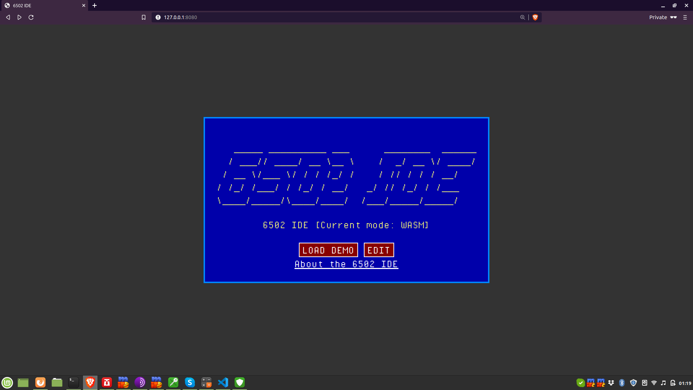

# Web 6502 IDE

[Try it live!](https://jeremyjstarcher.github.io/Web_6502_IDE/)

The Web 6502 IDE is a continuation of the many fine 6502 emulators
available on the web today, but it uses modern browser features to
combine some of the best pieces of software available today.

This first release has all of the features of the well-respected
site [6502asm.com](http://6502asm.com).

However, the source code is not 100% compatible between the two,
but the changes needed are quite minor.  I have copied all of the
examples from that site and have included them with this release.

## Why did you do this?

I enjoy retro computing and the simplicity of the old 8bit machines.
I wanted a sandboxed environment to explore in and show off my
creations.

However, I found that all of the web-based 6502 assemblers were 
usable, but lacked a lot of modern features I had gotten used to
with  `dasm`.  I figured I could either spent a few weeks adding
these features, or I could spent the time learn to use `emscripten`
and interfaing with `wasm.`

## Planned features

* Save!  Yes, I want to be able to save the code I am working on. Save to browser storage with the chance to download my library a a `zip` file.
* Add text output.  Set aside some memory as a frame buffer and let text I/O working.  Then I'd like to port one of the versions of BASIC over.
* Convert it to an application using Electron or some similiar tool.

## Credits

Under the hood, there are several pieces of software which makes 
this all possible.

* [emsciopten](https://emscripten.org/) is a C and C++ compiler that can target both JavaScript and Web Assembly (WASM).  This package was vital in porting the assembler and the 6502 emulator to the web.
* [dasm](https://dasm-assembler.github.io/) is an assembler that has been around for many years now and can target the 6502 microprocessor.
* [fake6502](https://dasm-assembler.github.io/) is a freely available 6502 emulator that has been well tested in a number of emulation projects.
* [CodeMirror](https://codemirror.net/) is a JavaScript based editor with many features far, far beyond a normal `textarea` element.

